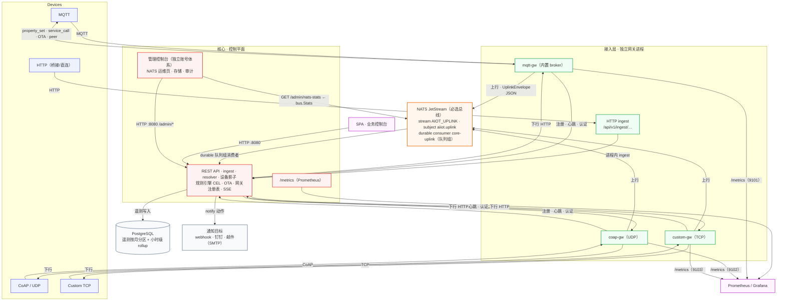

# AI IoT Platform — Architecture (Mermaid)

> 可在 GitLab、语雀、GitHub 等支持 Mermaid 的 Markdown 平台直接渲染。
> 与 README 中的 ASCII 图对应；更详细的接入协议说明见 [custom-protocol.md](custom-protocol.md)。

## 关键数据流

1. **数据平面（上行）**：设备 → 网关 → `NATS JetStream (aiiot.uplink)` → core 队列组消费 → ingest → PostgreSQL + 规则引擎。HTTP 直连上传不经 NATS，进程内直接进入 ingest。
2. **控制平面（HTTP，请求-响应）**：网关注册 / 心跳 / 设备认证走 HTTP。
3. **下行**：core → 网关 `9101..9103/downlink` → 设备（规则 `set_desired`、服务调用、OTA、workspace 内 peer 路由）。
4. **观测**：core 与每个网关各自暴露 `/metrics`；管理控制台 `/admin/nats` 直接读取 core 自身 NATS 连接的 stream/consumer 状态（轻量 nats-top，无需额外部署）。